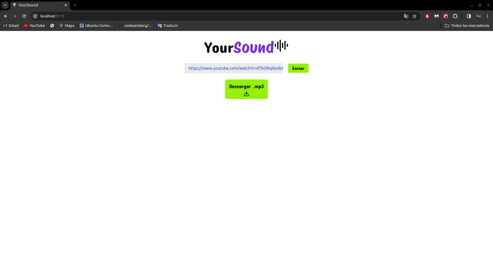

# YourSound (Extractor de audios de YT)
Este proyecto corresponde a la interfaz de usuario del proyecto [audio_yt_downloader](https://github.com/andr-33/audio_yt_downloader). Ambos proyectos en conjunto brindan la oportunidad al usuario de poder extraer audios de la plataforma de YouTube de forma segura. Está pensado para creadores de contenido, productores y DJs.

## Tecnologías y herramientas
- React + TypeScript
- Vite
- Tailwind

## Vista de la aplicación 

